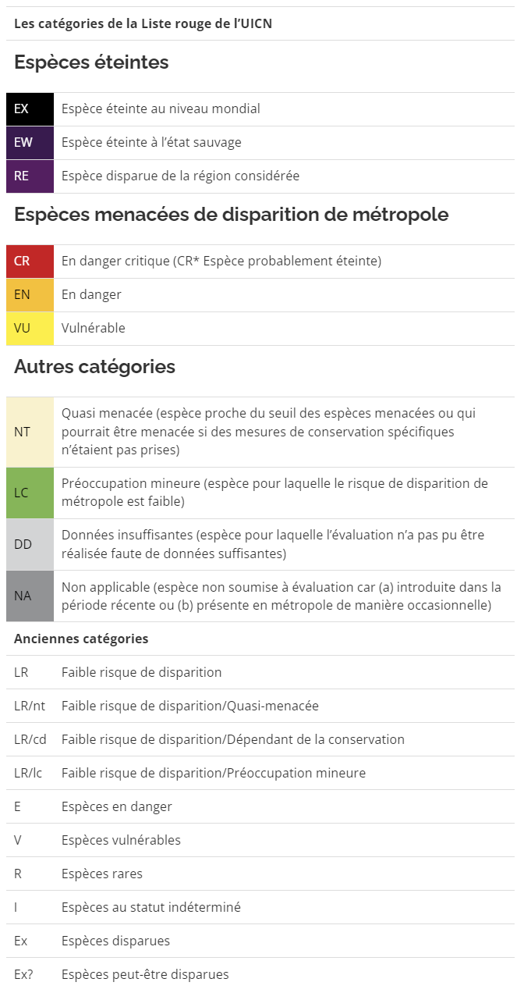

```{r setup, include = FALSE}
knitr::opts_chunk$set(echo = FALSE,
                      warning = FALSE,
                      message = FALSE,
                      fig.align = "center",  # figure centrée
                      fig.retina = 4,      # Qualité des figures
                      out.width = "100%",      # remplissage de la largeur
                      dev = 'png',        # Format des figures
                      cache = FALSE)     # Pas d'enregistrement
library(sf)
library(dplyr)
library(tidyverse)
library(tmaptools)
library(ggplot2)
library(ggthemes)
library(gridExtra)
library(fmsb) # radarchart
library(reshape2) # permet de permuter les colonnes et les lignes d'un R.data
library(flextable) # permet de faire des beaux tableaux
library(scales) # format des nombres

colors_esp <- c(
  "Arachnides" = "#E41A1C",      # Rouge vif
  "Autres" = "#377EB8",          # Bleu foncé
  "Reptiles" = "#4DAF4A",        # Vert
  "Poissons" = "#984EA3",        # Violet foncé
  "Angiospermes" = "#FF7F00",    # Orange
  "Amphibiens" = "#FFF333",      # Jaune vif
  "Insectes" = "#A65628",        # Brun
  "Mammifères" = "#F781BF",      # Rose
  "PMC" = "#D8B365",             # Brun clair
  "Crustacés" = "#66DAA0",       # Vert turquoise
  "Oiseaux" = "#3288BD",         # Bleu clair
  "Non spécifié"= "#BBBBBB"      # Gris
)

colors_pmc <- c(
  "Fouine" = "#E63946",                     # Rouge vif
  "Blaireau européen" = "#FFF333",          # Jaune clair
  "Renard roux" = "#F1C40F",                # Jaune doré
  "Belette d'Europe" = "#A8DADC",           # Bleu clair
  "Raton laveur" = "#457B9D",               # Bleu foncé
  "Putois d'Europe" = "#F77F00",            # Orange vif
  "Hermine" = "#D52380",                    # Rose
  "Martre des pins" = "#9D4EDD",            # Violet
  "Chat sauvage" = "#2A9D8F",               # Vert turquoise
  "Castor d'Eurasie" = "#FFAB00"            # Jaune-orange
)

colors_dep <- c(
  "02" = "#FF6F61",   # Coral
  "80" = "#a57fc7",   # Violet
  "62" = "#88B04B",   # Greenery
  "59" = "#D2AB85",   # Light Brown
  "60" = "#92A8D1"    # Serenity
)

colors_statut <- c(
  "Envahissantes" = "#F77F00",   # Orange
  "Menacées" = "#3DAF2A",        # Vert clair
  "Normales" = "#377EB8"      # Bleu clair
)

colors_pro <- c(
  "Protégées" = "darkgreen",   # Vert
  "Non protégées" = "darkblue"  # Jaune
)

# Ouverture des fichiers utiliser dans le Rmarkdown
OISON_PMC <- st_read("../processed_data/OISON_PMC.gpkg")
departements <- st_read("../processed_data/departements.gpkg")

# Retirer les données du paraclet
OISON_PMC <- OISON_PMC %>% 
  filter(INSEE_COM!="80213")

#Filtrage des données OISON et/ou PMC
nom_bases <- "(OISON+PMCC)"

if(params$OISON=="FALSE"){
  OISON_PMC <- OISON_PMC %>% 
  filter(GROUP2_INPN == "PMC") %>% 
  mutate(GROUP2_INPN = nom_vernaculaire) 
  nom_bases <-  "(PMC)"
  colors_esp <- colors_pmc}

if(params$PMC=="FALSE"){
  OISON_PMC <- OISON_PMC %>% 
  filter(GROUP2_INPN != "PMC")
  nom_bases <-  "(OISON)"}

if(params$PMC=="FALSE" & params$OISON=="FALSE"){
  nom_bases <-  "(AUCUNE BASE DE DONNEE)"}
```

# Introduction

Les données présentées sont issues des bases de données OISON et du réseau-PMCC de l'OFB. Elles font ici l'objet d'un suivi sur le nombre de saisies, le nombre d'observateurs, la saisie moyenne par observateur, les groupes d'espèces, leur statut dans les listes rouges ou envahissantes, les espèces protégées en France et leur répartition géographique.

Un observateur est relié au département dans lequel il a le plus saisie.

Les saisies sur la commune de Cottenchy (80) ont été exclues.

A propos de OISON :

Depuis toujours les agents de l'OFB sur le terrain réalisent des observations qu'ils peuvent maintenant compiler dans un outil informatique permettant la saisie informatique en mode nomade des observations relatives aux espèces et aux milieux. Les données collectées sont majoritairement le résultat d'observations opportunistes ou fortuites, mais elles peuvent aussi être le résultat de la mise en œuvre de protocoles qui se caractérisent par des formulaires simples (nombre de champs réduits).

A propos de rézo-PMCC :

Le réseau Petits et mésocarnivores (PMC) suit l’évolution de la répartition des populations de 14 espèces de carnivores en France métropolitaine, aux statuts règlementaires et de conservation variés. Les connaissances acquises grâce à ce réseau interne permettent à l’Office français de la biodiversité (OFB) d’apporter une expertise technique et scientifique sur ces espèces à tous les niveaux : départemental, régional, national et européen.

\newpage

# Evolutions sur la saisie `r nom_bases`

## Evolution du nombre de saisies

```{r}
saisies <- OISON_PMC %>% 
  st_set_geometry(NULL) %>%                          # Supprime la géométrie des données spatiales
  filter(annee >= params$annee_debut & annee <= params$annee_fin) %>%  # Filtre les années
  group_by(annee, INSEE_DEP) %>%                     # Regroupe les données par année et département
  summarise(nombre_saisies = n())                    # Calcule le nombre de saisies par groupe

saisies_histo <- saisies                             # Copie le dataframe 'saisies'
saisies_histo$annee <- as.factor(saisies_histo$annee) # Transforme la colonne 'annee' en facteur

saisie_derniere_annee <- saisies %>% 
  filter(annee == params$annee_fin) %>%              # Filtre pour l'année spécifiée
  arrange(nombre_saisies) %>%                        # Trie par nombre de saisies
  mutate(pourcentage = round((nombre_saisies / sum(nombre_saisies)) * 100)) %>% # Calcule le pourcentage de chaque département
  mutate(cumulative = pourcentage / 2 + c(0, cumsum(pourcentage)[-length(pourcentage)])) # Calcule le cumul des pourcentages

saisie_derniere_annee$INSEE_DEP <- saisie_derniere_annee$INSEE_DEP %>% 
  factor(levels = rev(saisie_derniere_annee$INSEE_DEP)) # Reclassifie les départements en ordre inverse

saisies$INSEE_DEP <- saisies$INSEE_DEP %>% 
  factor(levels = rev(saisie_derniere_annee$INSEE_DEP)) # Reclassifie les départements selon l'ordre de la dernière année

saisies_histo$INSEE_DEP <- saisies_histo$INSEE_DEP %>% 
  factor(levels = rev(saisie_derniere_annee$INSEE_DEP)) # Reclassifie les départements selon l'ordre de la dernière année

```

<br>

```{r , fig.width = 6 , fig.height = 3.5}
# Transformation en tableau croisé dynamique
saisies_tableau <- saisies %>%
  dcast(annee ~ INSEE_DEP, value.var = "nombre_saisies", fill = 0) %>% # transforme en tableau
  mutate(total = rowSums(select(., -annee), na.rm = TRUE)) %>% # calcul les totaux
  mutate(annee = as.character(annee)) # met annee en caractere

# Appliquer le format français aux colonnes appropriées
saisies_tableau <- saisies_tableau %>%
  mutate(across(-annee, ~ format(., big.mark = " ", decimal.mark = ",", scientific = FALSE, trim = TRUE)))

width(
  
flextable(saisies_tableau) %>%
  set_header_labels(
    annee = "Année",
    `02` = "02",
    `59` = "59",
    `60` = "60",
    `62` = "62",
    `80` = "80",
    total = "Total"
  ) %>%
  theme_vanilla() %>%
  color(part = "header", color = "white") %>%
  bg(part = "header", bg = "#333333") %>%
  bold(part = "header") %>% 
  align(j = 2:7, align = "right") %>%   # Aligner à droite les colonnes de saisies
  align(part = "header",j = 2:7, align = "right") %>% 
  set_caption(caption = paste("Evolution du nombre de saisies par département",nom_bases))
  
, width = 1)
```

<br>

```{r , fig.width = 6.5 , fig.height = 3.5}
ggplot(saisies) +
  aes(x = annee, y = nombre_saisies, fill = INSEE_DEP) + # Choisi les axes du graphique et la légende
  geom_area() +  # Créer un graphique par aire
  scale_fill_manual(values = colors_dep) + # couleurs de la légende
  labs(
    x = "Années",
    y = "Nombre de saisies",
    fill = "Départements",
    title = paste("Evolution du nombre de saisies par département",nom_bases)
  ) +
  geom_text(data = filter(saisies, annee == params$annee_fin), # affiche les valeurs de l'année annee_fin
            aes(label = nombre_saisies, x = annee + 0.2),
            position = position_stack(vjust = 0.5),
            size = 3) +
  theme_minimal() +
  theme(text = element_text(size = 9))
```

```{r , fig.width = 6.5 , fig.height = 3.5}
ggplot(saisies_histo) +
  aes(x = INSEE_DEP, y = nombre_saisies, fill = annee) +
  geom_col(position = "dodge2") +
  scale_fill_brewer(palette = "Blues") +
  labs(
    x = "Départements",
    y = "Nombre de saisies",
    fill = "Années",
    title = paste("Evolution du nombre de saisies par département",nom_bases)
  ) +
  theme_minimal()+
  guides(fill = guide_legend(reverse = TRUE)) +
  theme(text = element_text(size = 9))
```

```{r , fig.width = 6.5 , fig.height = 3.5}
ggplot(saisie_derniere_annee) +
  aes(x = factor(1), y = pourcentage, fill = INSEE_DEP) +
  geom_bar(width = 1, stat = "identity", color = "white") +
  scale_fill_manual(values = colors_dep) +
  coord_polar(theta = "y") +
  theme_void() +
  geom_text(aes(x = 1.2, 
                y = cumulative, 
                label = paste(nombre_saisies, "\n", pourcentage, "%")),
                size = 3
  ) +
  labs(
    fill = "Départements",
    title = paste("Proportions par département du nombre de saisies en", params$annee_fin, "(OISON+PMC)")
  ) +
  theme(
    text = element_text(size = 9),
    plot.title = element_text(hjust = 0.2),  # Aligne le titre à gauche
    legend.margin = margin(t = 0, r = 0, b = 0, l = 50),  # Espace à gauche de la légende
    plot.margin = margin(t = 1, r = 1, b = 1, l = 1)
  )
```

\newpage

## Evolution du nombre d'observateurs

```{r}
observateurs <- OISON_PMC %>% 
  filter(annee >= params$annee_debut & annee <= params$annee_fin) %>%
  st_set_geometry(NULL) %>% 
  select(annee, INSEE_DEP, Observateur) %>%
  # Compter le nombre d'observations par observateur et département
  group_by(annee, INSEE_DEP, Observateur) %>%
  summarise(nombre_observations = n(), .groups = 'drop') %>%
  # Trouver le maximum de nombre d'observations par observateur
  group_by(annee, Observateur) %>%
  filter(nombre_observations == max(nombre_observations)) %>%
  ungroup() %>%
  # Déduire le département avec le maximum d'observations pour chaque observateur
  group_by(annee, INSEE_DEP) %>%
  summarise(nombre_observateurs = n_distinct(Observateur), .groups = 'drop')

observateurs_histo <- observateurs
observateurs_histo$annee <- as.factor(observateurs_histo$annee)

observateurs_derniere_annee <- observateurs %>% 
  filter(annee == params$annee_fin) %>% 
  arrange(nombre_observateurs) %>% 
  mutate(pourcentage = round((nombre_observateurs / sum(nombre_observateurs)) * 100)) %>% 
  mutate(cumulative = pourcentage / 2 + c(0, cumsum(pourcentage)[-length(pourcentage)]))

observateurs_derniere_annee$INSEE_DEP <- observateurs_derniere_annee$INSEE_DEP %>% 
  factor(levels = rev(observateurs_derniere_annee$INSEE_DEP))

observateurs$INSEE_DEP <- observateurs$INSEE_DEP %>% 
  factor(levels = rev(observateurs_derniere_annee$INSEE_DEP))

observateurs_histo$INSEE_DEP <- observateurs_histo$INSEE_DEP %>% 
  factor(levels = rev(observateurs_derniere_annee$INSEE_DEP))
```

<br>

```{r , fig.width = 6 , fig.height = 3.5}
# Transformation en tableau croisé
observateurs_tableau <- observateurs %>%
  dcast(annee ~ INSEE_DEP, value.var = "nombre_observateurs", fill = 0) %>% # transforme en tableau
  mutate(total = rowSums(select(., -annee), na.rm = TRUE)) %>% # calcul les totaux
  mutate(annee = as.character(annee)) # met annee en caractere

# Appliquer le format français aux colonnes appropriées
observateurs_tableau <- observateurs_tableau %>%
  mutate(across(-annee, ~ format(., big.mark = " ", decimal.mark = ",", scientific = FALSE, trim = TRUE)))

width(
  
flextable(observateurs_tableau) %>%
  set_header_labels(
    annee = "Année",
    `02` = "02",
    `59` = "59",
    `60` = "60",
    `62` = "62",
    `80` = "80",
    total = "Total"
  ) %>%
  theme_vanilla() %>%
  color(part = "header", color = "white") %>%
  bg(part = "header", bg = "#333333") %>%
  bold(part = "header") %>% 
  align(j = 2:7, align = "right") %>%   # Aligner à droite les colonnes de saisies
  align(part = "header",j = 2:7, align = "right") %>% 
  set_caption(caption = paste("Evolution du nombre d'observateurs par département",nom_bases))
  
, width = 1)
```

<br>

```{r , fig.width = 6.5 , fig.height = 3.5}
ggplot(observateurs) +
  aes(x = annee, y = nombre_observateurs, fill = INSEE_DEP) +
  geom_area() +
  scale_fill_manual(values = colors_dep) +
  labs(
    x = "Années",
    y = "Nombre d'observateurs",
    fill = "Départements",
    title = paste("Evolution du nombre d'observateurs par département",nom_bases)
  ) +
  geom_text(data = filter(observateurs, annee == params$annee_fin),
            aes(label = nombre_observateurs, x = annee + 0.2),
            position = position_stack(vjust = 0.5),
            size = 3) +
  theme_minimal() +
  theme(text = element_text(size = 9))
```

```{r , fig.width = 6.5 , fig.height = 3.5}
ggplot(observateurs_histo) +
  aes(x = INSEE_DEP, y = nombre_observateurs, fill = annee) +
  geom_col(position = "dodge2") +
  scale_fill_brewer(palette = "Blues") +
  labs(
    x = "Départements",
    y = "Nombre d'observateurs",
    fill = "Années",
    title = paste("Evolution du nombre d'observateurs par département",nom_bases)
  ) +
  theme_minimal()+
  guides(fill = guide_legend(reverse = TRUE)) +
  theme(text = element_text(size = 9))
```

```{r , fig.width = 6.5 , fig.height = 3.5}
ggplot(observateurs_derniere_annee) +
  aes(x = factor(1), y = pourcentage, fill = INSEE_DEP) +
  geom_bar(width = 1, stat = "identity", color = "white") +
  scale_fill_manual(values = colors_dep) +
  coord_polar(theta = "y") +
  theme_void() +
  geom_text(aes(x = 1.2, 
                y = cumulative, 
                label = paste(nombre_observateurs, "\n", pourcentage, "%")),
                size = 3
  ) +
  labs(
    fill = "Départements",
    title = paste("Proportions par département du nombre d'observateurs en", params$annee_fin, nom_bases)
  ) +
  theme(
    text = element_text(size = 9),
    plot.title = element_text(hjust = 0.2),  # Aligne le titre à gauche
    legend.margin = margin(t = 0, r = 0, b = 0, l = 50),  # Espace à gauche de la légende
    plot.margin = margin(t = 1, r = 1, b = 1, l = 1)
  )
```

\newpage

## Evolution du nombre moyen de saisie par observateur

```{r}
saisies_observateur <- saisies %>%
  left_join(observateurs) %>%
  mutate(moyenne_saisies_observateur =
           ifelse(!is.na(nombre_observateurs)
                  & nombre_observateurs > 0, 
                  nombre_saisies / nombre_observateurs, 
                  0)) %>% 
  select(annee,INSEE_DEP,moyenne_saisies_observateur)
  
saisies_observateur_histo <- Observateursaisies_observateur_histo <- saisies_observateur
saisies_observateur_histo$annee <- as.factor(saisies_observateur_histo$annee)

saisies_observateur_derniere_annee <- saisies_observateur %>%
  filter(annee == params$annee_fin) %>%
  arrange(moyenne_saisies_observateur)

saisies_observateur$INSEE_DEP <- saisies_observateur$INSEE_DEP %>% 
  factor(levels = rev(saisies_observateur_derniere_annee$INSEE_DEP))

saisies_observateur_histo$INSEE_DEP <- saisies_observateur_histo$INSEE_DEP %>% 
  factor(levels = rev(saisies_observateur_derniere_annee$INSEE_DEP))

```

<br>

```{r , fig.width = 6 , fig.height = 3.5}
# Calcul les moyennes totales
saisies_observateur_moy <- OISON_PMC %>%
  group_by(annee, Observateur) %>%
  summarise(nombre_saisies = n()) %>%
  group_by(annee) %>%
  filter(annee >= params$annee_debut & annee <= params$annee_fin) %>%
  summarise(moyenne_saisies_observateur = round(mean(nombre_saisies),1)) %>% 
  st_set_geometry(NULL)

# Transformation en tableau croisé dynamique
saisies_observateur_tableau <- saisies_observateur %>%
  mutate(moyenne_saisies_observateur=round(moyenne_saisies_observateur,1)) %>%  # arrondi les moyennes
  dcast(annee ~ INSEE_DEP, value.var = "moyenne_saisies_observateur", fill = 1) %>% # transforme en tableau
  mutate(total=saisies_observateur_moy$moyenne_saisies_observateur) %>%  # ajoute les moyennes totales
  mutate(annee = as.character(annee)) # met annee en caractere

# Appliquer le format français aux colonnes appropriées
saisies_observateur_tableau <- saisies_observateur_tableau %>%
  mutate(across(-annee, ~ format(., big.mark = " ", decimal.mark = ",", scientific = FALSE, trim = TRUE)))

width(
  
flextable(saisies_observateur_tableau) %>%
  set_header_labels(
    annee = "Année",
    `02` = "02",
    `59` = "59",
    `60` = "60",
    `62` = "62",
    `80` = "80",
    total = "Région"
  ) %>%
  theme_vanilla() %>%
  color(part = "header", color = "white") %>%
  bg(part = "header", bg = "#333333") %>%
  bold(part = "header") %>% 
  align(j = 2:7, align = "right") %>%   # Aligner à droite les colonnes de saisies
  align(part = "header",j = 2:7, align = "right") %>% 
  set_caption(caption = paste("Evolution du nombre moyen de saisie par observateur par département",nom_bases))
  
, width = 1)
```

<br>

```{r , fig.width = 6.5 , fig.height = 3.5}
ggplot(saisies_observateur) +
  aes(
    x = annee,
    y = moyenne_saisies_observateur,
    colour = INSEE_DEP
  ) +
  geom_smooth(se = FALSE) +
  labs(
    x = "Années",
    y = "Saisie moyenne par observateur",
    color = "Départements",
    title = paste("Evolution du nombre moyen de saisie par observateur", nom_bases)
  ) +
  scale_color_manual(values=colors_dep) +
  theme_minimal()+
  theme(text = element_text(size = 9))
```

```{r , fig.width = 6.5 , fig.height = 3.5}
ggplot(saisies_observateur_histo) +
  aes(x = INSEE_DEP, y = moyenne_saisies_observateur, fill = annee) +
  geom_col(position = "dodge2") +
  scale_fill_brewer(palette = "Blues") +
  labs(
    x = "Départements",
    y = "Saisie moyenne par observateur",
    fill = "Années",
    title = paste("Evolution du nombre moyen de saisie par observateur",nom_bases)
  ) +
  theme_minimal()+
  guides(fill = guide_legend(reverse = TRUE)) +
  theme(text = element_text(size = 9))
```

```{r}
saisies_observateur_violon <- OISON_PMC %>%
  group_by(annee, INSEE_DEP, Observateur) %>%
  summarise(nombre_saisies = n()) %>%
  filter(annee == params$annee_fin)

saisies_observateur_violon$INSEE_DEP <- saisies_observateur_violon$INSEE_DEP %>% 
  factor(levels = rev(saisies_observateur_derniere_annee$INSEE_DEP))
```

```{r , fig.width = 6.5 , fig.height = 5, eval=FALSE }
# eval = FALSE permet de ne pas lancer le programme # le graphique ne s'affiche pas

ggplot(saisies_observateur_violon, aes(x = INSEE_DEP, y = nombre_saisies)) +
  geom_boxplot(fill = colors_dep, color = "black") +
  stat_summary(fun = mean, geom = "point", shape = 18, size = 3, color = "red", fill = "red") +
  labs(
    x = "Départements",
    y = "Nombre de saisies par observateur",
    title = paste("Répartition du nombre de saisies par observateur en",params$annee_fin, nom_bases),
    caption = "Explications : 
    - Ligne centrale dans chaque boîte représente la médiane.
    - Les bords de chaque boîte représentent les 1er et 3e quartiles (Q1 et Q3).
    - Les 'moustaches' s'étendent jusqu'aux points les plus éloignés qui ne sont pas des valeurs aberrantes.
    - Les losanges rouges représentent la moyenne."
  ) +
  theme_minimal()+
  theme(plot.caption = element_text(hjust = 0, size = 10, margin = margin(t = 10))) +
  theme(
    plot.caption = element_text(hjust = 0, size = 8, margin = margin(t = 10)),
    text = element_text(size = 9)
  )
```

```{r , fig.width = 6.5 , fig.height = 4}
ggplot(saisies_observateur_violon, aes(x = INSEE_DEP, y = nombre_saisies, fill=INSEE_DEP)) +
  geom_violin(color = "black") +
  scale_fill_manual(values = colors_dep) +
  stat_summary(fun = mean, geom = "point", shape = 18, size = 3, color = "red", fill="red") +
  stat_summary(fun = median, geom = "point", shape = 15, size = 2, color = "black",fill="black") +
  labs(
    x = "Départements",
    y = "Nombre de saisies par observateur",
    fill="Départements",
    title = paste("Répartition du nombre de saisie par observateur en",params$annee_fin, nom_bases),
    caption="Explications :
    - Pour un nombre de saisie donné, plus la zone est large, plus il y a d'observateurs
    - Le carré noir représente la médiane
    - Le losange rouge représente la moyenne"
  ) +
  theme_minimal()+
  theme(plot.caption = element_text(hjust = 0, size = 10, margin = margin(t = 10))) +
  theme(
    plot.caption = element_text(hjust = 0, size = 8, margin = margin(t = 10)),
    text = element_text(size = 9)
  )
```

\newpage

# Evolution sur les espèces

## Evolution du nombre régional de saisies par groupe d'espèces

```{r}
groupes_espece_par_annee <- OISON_PMC %>% 
 filter(annee >= params$annee_debut & annee <= params$annee_fin) %>%
  filter(GROUP2_INPN != "Non spécifié") %>% 
  group_by(annee,GROUP2_INPN) %>% 
  summarise(nb_saisies = n()) %>% 
  st_set_geometry(NULL) %>% 
  arrange(desc(nb_saisies))

# Ordre des espèces dans la légende décroissante
groupes_espece_par_annee$GROUP2_INPN <- factor(groupes_espece_par_annee$GROUP2_INPN, 
                                               levels = unique(groupes_espece_par_annee$GROUP2_INPN))
```

```{r , fig.width = 6.5 , fig.height = 3.5}
ggplot(groupes_espece_par_annee) +
  aes(x = annee, y = nb_saisies, colour = GROUP2_INPN) +
  geom_smooth(se = FALSE) +
  geom_point()+
  scale_colour_manual(values = colors_esp) +
  labs(x = "Années",
       y = "Nombre de saisies",
       colour = "Groupes d'espèces",
       title = paste("Evolution du nombre régional de saisies par groupe d'espèces",nom_bases)) +
  theme_minimal() +
  theme(text = element_text(size = 9))
```

```{r}
groupes_espece <- OISON_PMC %>% 
  group_by(GROUP2_INPN) %>% 
  filter(annee==params$annee_fin) %>% 
  summarise(nb_saisies = n()) %>% 
  st_set_geometry(NULL) %>% 
  arrange(nb_saisies) %>% 
  mutate(pourcentage = round((nb_saisies / sum(nb_saisies)) * 100)) %>% 
  mutate(cumulative = pourcentage / 2 + c(0, cumsum(pourcentage)[-length(pourcentage)]))
  
# Ordre des espèces décoissant  
groupes_espece$GROUP2_INPN <- groupes_espece$GROUP2_INPN %>% 
  factor(levels = rev(groupes_espece$GROUP2_INPN))
```

```{r , fig.width = 6.5 , fig.height = 3.5}
ggplot(groupes_espece)+
  aes(x = factor(1), y = pourcentage, fill = GROUP2_INPN) +
  geom_bar(width = 1, stat = "identity", color = "white") +
  coord_polar(theta = "y")+
  theme_void()+
  scale_fill_manual(values = colors_esp) +
  geom_text(data=tail(groupes_espece,3),
            aes(x = 1.8, 
                y = cumulative, 
                label=paste0(GROUP2_INPN, "\n (",pourcentage, "%)")),
                size = 3)+
  labs(
    title = paste("Proportions du nombre régional de saisies par groupe d'espèce en",params$annee_fin,nom_bases),
    fill = "Groupes d'espèces"
    ) +
  theme(
    text = element_text(size = 9),
    plot.title = element_text(hjust = 0.2),  # Aligne le titre à gauche
    legend.margin = margin(t = 0, r = 0, b = 0, l = 50),  # Espace à gauche de la légende
    plot.margin = margin(t = 1, r = 1, b = 1, l = 1)
  )
```

\newpage

<br> <br>

```{r}
groupes_espece_dep <- OISON_PMC %>% 
  group_by(GROUP2_INPN,INSEE_DEP) %>% 
  filter(annee==params$annee_fin) %>% 
  summarise(nb_saisies = n()) %>% 
  st_set_geometry(NULL) 

# Transformation en tableau croisé
groupes_espece_tableau <- OISON_PMC %>% 
  group_by(GROUP2_INPN) %>% 
  filter(annee==params$annee_fin) %>% 
  summarise(nb_saisies = n()) %>% 
  st_set_geometry(NULL) %>% 
  mutate(INSEE_DEP="Région") %>% 
  bind_rows(groupes_espece_dep) %>% 
  dcast(GROUP2_INPN ~ INSEE_DEP, value.var = "nb_saisies", fill = 0)

# Calcul de la ligne "Total" et des pourcentages
totaux <- groupes_espece_tableau %>%
  summarise(across(where(is.numeric), sum, na.rm = TRUE)) %>%
  mutate(GROUP2_INPN = "Total")
  
groupes_espece_tableau <- groupes_espece_tableau %>% 
  bind_rows(totaux) %>% 
  arrange(Région) %>% 
  mutate(across(-GROUP2_INPN, ~ . / totaux$., .names = "pourc_{.col}")) %>% 
  mutate(across(starts_with("pourc_"), ~ percent(., big.mark = " ", decimal.mark = ",", accuracy = 1))) %>% 
  mutate(across(-GROUP2_INPN, ~ format(., big.mark = " ", decimal.mark = ",", scientific = FALSE, trim = TRUE))) %>% 
  relocate(pourc_02,.after="02") %>% 
  relocate(pourc_59,.after="59") %>% 
  relocate(pourc_60,.after="60") %>% 
  relocate(pourc_62,.after="62") %>% 
  relocate(pourc_80,.after="80")
```

```{r , fig.width = 6 , fig.height = 3.5}

width(
  
flextable(groupes_espece_tableau) %>%
  set_header_labels(
    GROUP2_INPN = "Groupes d'espèce",
    pourc_02 = "%",
    pourc_59 = "%",
    pourc_60 = "%",
    pourc_62 = "%",
    pourc_80 = "%",
    pourc_Région = "%"
  ) %>%
  theme_vanilla() %>%
  color(part = "header", color = "white") %>%
  bg(part = "header", bg = "#333333") %>%
  bold(part = "header") %>% 
  fontsize(part="all",j = c(3,5,7,9,11,13),size=8) %>%
  bg(i=nrow(groupes_espece_tableau), bg = "#DDDDDD") %>%
  align(j = 2:13, align = "right") %>%   # Aligner à droite les colonnes de saisies
  align(part = "header",j = 2:13, align = "right") %>% 
  set_caption(caption = paste("Nombre de saisies par groupe d'espèces et par département en", params$annee_fin ,nom_bases)) %>% 
  set_table_properties(width = 0.8, layout = "autofit")
  
, width = 0.5)
```

```{r, results='asis'}
# Condition pour afficher le titre
if (params$OISON) {
  cat("\\newpage\n")
  cat("## Evolution du nombre régional de saisies par groupe d'espèces hors oiseaux\n")
}
```

```{r}
if (params$OISON) {
  groupes_espece_par_annee_sans_oiseaux <- OISON_PMC %>% 
    group_by(annee, GROUP2_INPN) %>% 
    filter(annee >= params$annee_debut & annee <= params$annee_fin) %>%
    filter(GROUP2_INPN != "Oiseaux") %>%
    filter(GROUP2_INPN != "Non spécifié") %>%
    summarise(nb_saisies = n()) %>% 
    st_set_geometry(NULL) %>% 
    arrange(desc(nb_saisies))

  # Ordre des espèces dans la légende décroissante
  groupes_espece_par_annee_sans_oiseaux$GROUP2_INPN <- factor(
    groupes_espece_par_annee_sans_oiseaux$GROUP2_INPN, 
    levels = unique(groupes_espece_par_annee_sans_oiseaux$GROUP2_INPN)
  )
}
```

```{r , fig.width = 6.5 , fig.height = 3.5}
if (params$OISON) {
  ggplot(groupes_espece_par_annee_sans_oiseaux) +
    aes(x = annee, y = nb_saisies, colour = GROUP2_INPN) +
    geom_smooth(se = FALSE) +
    geom_point() +
    scale_colour_manual(values = colors_esp) +
    labs(x = "Années",
         y = "Nombre de saisies",
         colour = "Groupes d'espèce",
         title = paste("Evolution du nombre régional de saisies par groupe d'espèces hors oiseaux", nom_bases)) +
    theme_minimal() +
    theme(
      text = element_text(size = 9),
      plot.title = element_text(size = 10)  # Ajustez la taille du titre ici
    )
}
```

```{r}
if (params$OISON) {
  groupes_espece_sans_oiseaux <- OISON_PMC %>% 
    group_by(GROUP2_INPN) %>% 
    filter(annee == params$annee_fin) %>%
    filter(GROUP2_INPN != "Oiseaux") %>%
    summarise(nb_saisies = n()) %>% 
    st_set_geometry(NULL) %>% 
    arrange(nb_saisies) %>% 
    mutate(pourcentage = round((nb_saisies / sum(nb_saisies)) * 100)) %>% 
    mutate(cumulative = pourcentage / 2 + c(0, cumsum(pourcentage)[-length(pourcentage)]))

  # Ordre des espèces décroissant  
  groupes_espece_sans_oiseaux$GROUP2_INPN <- groupes_espece_sans_oiseaux$GROUP2_INPN %>% 
    factor(levels = rev(groupes_espece_sans_oiseaux$GROUP2_INPN))
}
```

```{r , fig.width = 6.5 , fig.height = 3.5}
if (params$OISON) {
  ggplot(groupes_espece_sans_oiseaux) +
    aes(x = factor(1), y = pourcentage, fill = GROUP2_INPN) +
    geom_bar(width = 1, stat = "identity", color = "white") +
    coord_polar(theta = "y") +
    theme_void() +
    scale_fill_manual(values = colors_esp) +
    
    geom_text(data = tail(groupes_espece_sans_oiseaux, 6),
              aes(x = 1.9, 
                  y = cumulative, 
                  label = paste(GROUP2_INPN, "\n", pourcentage, "%")),
                  size = 3) +
    labs(
      fill = "Groupes d'espèce",
      title = paste("Proportions du nombre régional de saisies par groupe d'espèces hors oiseaux en", params$annee_fin, nom_bases)
    ) +
  theme(
    text = element_text(size = 9),
    plot.title = element_text(hjust = 0.2, size = 9),  # Aligne le titre à gauche et change la taille
    legend.margin = margin(t = 0, r = 0, b = 0, l = 50),  # Espace à gauche de la légende
    plot.margin = margin(t = 1, r = 3, b = 1, l = 3)
  )
}
```

\newpage

## Répartition des saisies d'espèces hors oiseaux par département

<br> Graphiques radars sur les proportions (%) d'espèces saisies hors oiseaux de `r params$annee_debut` à `r params$annee_fin` : <br>

```{r}
# Fonction pour créer des graphiques radars (library(fmsb))
create_beautiful_radarchart <- function(data, color = "#00AFBB", 
                                        vlabels = colnames(data), vlcex = 0.7,
                                        caxislabels = NULL, title = NULL, plwd = 2,...){
  radarchart(
    data, axistype = 1,
    # Personnaliser le polygone
    pcol = color, pfcol = scales::alpha(color, 0.5), plwd = 2, plty = 1,
    # Personnaliser la grille
    cglcol = "grey", cglty = 1, cglwd = 0.8,
    # Personnaliser l'axe
    axislabcol = "grey", 
    # Étiquettes des variables
    vlcex = vlcex, vlabels = vlabels,
    caxislabels = caxislabels, title = title, ...
  )
}
```

```{r}
# Filtrage et regroupement des données
radar_especes_dep <- OISON_PMC %>% 
  filter(annee >= params$annee_debut & annee <= params$annee_fin) %>%
  filter(GROUP2_INPN != "Oiseaux") %>% 
  filter(GROUP2_INPN != "Non spécifié") %>% 
  group_by(GROUP2_INPN, INSEE_DEP) %>% 
  summarise(nb_saisies = n(), .groups = 'drop') %>% 
  st_set_geometry(NULL)

# Calcul des totaux par département
totaux2 <- OISON_PMC %>% 
  filter(annee >= params$annee_debut & annee <= params$annee_fin) %>%
  filter(GROUP2_INPN != "Oiseaux") %>% 
  group_by(INSEE_DEP) %>% 
  st_set_geometry(NULL) %>% 
  summarise(total = n(), .groups = 'drop')

# Fusionner les deux tables
radar_especes_dep <- radar_especes_dep %>% 
  left_join(totaux2, by = "INSEE_DEP") %>%
  mutate(pourcentage = round((nb_saisies / total )*100,0))

radar_especes_dep <- radar_especes_dep %>%
  dcast(INSEE_DEP ~ GROUP2_INPN, value.var = "pourcentage", fill = 0)

# Combine max/min with the radar data
radar_especes_dep <- rbind(rep(100,ncol(radar_especes_dep)),rep(0,ncol(radar_especes_dep)), radar_especes_dep)
```

```{r , fig.width = 6.5 , fig.height = 2.5}
# Réduire la marge du graphique à l'aide de par()
# Diviser l'écran en 3 parties
op <- par(mar = c(1, 1,1,1))
par(mfrow = c(1,2))
# Create radar charts
for(i in 1:5){
  create_beautiful_radarchart(
    vlcex = 0.6,
    color = colors_dep[radar_especes_dep$INSEE_DEP[i+2]],
    data = select(radar_especes_dep[c(1, 2, i + 2), ], -INSEE_DEP),
    caxislabels = seq.int(0,100,length.out = 5),  # Adjust caxislabels as needed
    title = radar_especes_dep$INSEE_DEP[i+2]   # Ensure titles is defined
  )
}
par(op)
```

\newpage

# Evolution des saisies d'espèces menacées et envahissantes

## Evolution du nombre régional de saisies par statut

```{r}
statuts_espece_par_annee <- OISON_PMC %>% 
  filter(annee >= params$annee_debut & annee <= params$annee_fin) %>%
  st_set_geometry(NULL) %>% 
  filter(!is.na(statut_LR)) %>% 
  group_by(annee,statut_LR) %>% 
  summarise(nb_saisies = n()) %>% 
  arrange(desc(nb_saisies))

# Ordre des espèces dans la légende décroissante
statuts_espece_par_annee$statut_LR <- factor(statuts_espece_par_annee$statut_LR, 
                                               levels = unique(statuts_espece_par_annee$statut_LR))
```

<br>

```{r , fig.width = 6 , fig.height = 3.5}
# Transformation en tableau croisé dynamique
statuts_espece_par_annee_tableau <- statuts_espece_par_annee %>%
  dcast(annee ~ statut_LR, value.var = "nb_saisies", fill = 0) %>% # transforme en tableau
  mutate(total = rowSums(select(., -annee), na.rm = TRUE)) %>% # calcul les totaux
  mutate(annee = as.character(annee)) # met annee en caractere

# Appliquer le format français aux colonnes appropriées
statuts_espece_par_annee_tableau <- statuts_espece_par_annee_tableau %>%
  mutate(across(-annee, ~ format(., big.mark = " ", decimal.mark = ",", scientific = FALSE, trim = TRUE)))

width(
  
flextable(statuts_espece_par_annee_tableau) %>%
  set_header_labels(
    annee = "Année",
    total = "Total"
  ) %>%
  theme_vanilla() %>%
  color(part = "header", color = "white") %>%
  bg(part = "header", bg = "#333333") %>%
  bold(part = "header") %>% 
  align(j = 2:5, align = "right") %>%   # Aligner à droite les colonnes de saisies
  align(part = "header",j = 2:5, align = "right") %>% 
  set_caption(caption = paste("Evolution du nombre régional de saisies par statut" ,nom_bases)) %>% 
  set_table_properties(width = 0.8, layout = "autofit")
  
, width = 1)
```

<br>

```{r , fig.width = 6.5 , fig.height = 3.5}
ggplot(statuts_espece_par_annee) +
  aes(x = annee, y = nb_saisies, colour = statut_LR) +
  geom_smooth(se = FALSE) +
  geom_point() +
  scale_colour_manual(values = colors_statut) +
  labs(x = "Années",
       y = "Nombre de saisies",
       colour = "Statuts",
       title = paste("Evolution du nombre régional de saisies par statut", nom_bases)) +
  theme_minimal() +
  theme(text = element_text(size = 9))

```

```{r , fig.width = 6.5 , fig.height = 3.5}
statuts_espece <- OISON_PMC %>% 
  st_set_geometry(NULL) %>% 
  filter(annee==params$annee_fin) %>% 
  filter(!is.na(statut_LR)) %>% 
  group_by(statut_LR) %>% 
  summarise(nb_saisies = n()) %>% 
  arrange(nb_saisies) %>% 
  mutate(pourcentage = round((nb_saisies / sum(nb_saisies)) * 100)) %>% 
  mutate(cumulative = pourcentage / 2 + c(0, cumsum(pourcentage)[-length(pourcentage)]))

# Ordre des espèces décoissant  
statuts_espece$statut_LR <- statuts_espece$statut_LR %>% 
  factor(levels = rev(statuts_espece$statut_LR))
```

```{r , fig.width = 6.5 , fig.height = 3.5}
ggplot(statuts_espece)+
  aes(x = factor(1), y = pourcentage, fill = statut_LR) +
  geom_bar(width = 1, stat = "identity", color = "white") +
  coord_polar(theta = "y")+
  theme_void()+
   scale_fill_manual(values = colors_statut)+
  
  geom_text(data=tail(statuts_espece,4),
            aes(x = 1.8, 
                y = cumulative, 
                label=paste(statut_LR,"\n",pourcentage, "%")),
                size = 3)+
  labs(
    fill = "Statuts",
    title = paste("Proportions du nombre régional de saisies par statut en",params$annee_fin,nom_bases)
    ) +
  theme(
    text = element_text(size = 9),
    plot.title = element_text(hjust = 0.2),  # Aligne le titre à gauche
    legend.margin = margin(t = 0, r = 0, b = 0, l = 50),  # Espace à gauche de la légende
    plot.margin = margin(t = 1, r = 1, b = 1, l = 1)
  )
```

```{r , fig.width = 6.5 , fig.height = 3.5}
statuts_espece_dep <- OISON_PMC %>% 
  filter(annee==params$annee_fin) %>% 
  filter(!is.na(statut_LR))

ggplot(statuts_espece_dep) +
  aes(x = statut_LR, fill = INSEE_DEP) +
  geom_bar(position = "dodge2") +
  scale_fill_manual(values = colors_dep) +
  labs(
    x = "Statuts",
    y = "Nombre de saisies",
    fill = "Départements",
    title = paste("Nombre de saisies par statut par département en", params$annee_fin, nom_bases)) +
  theme_minimal() +
  theme(text = element_text(size = 9))
```

\newpage

# Evolutions des saisies d'espèces protégées

```{r}
espece_pro_par_annee <- OISON_PMC %>% 
  filter(annee >= params$annee_debut & annee <= params$annee_fin) %>%
  st_set_geometry(NULL) %>% 
  group_by(annee,espece_pro) %>% 
  summarise(nb_saisies = n()) %>% 
  arrange(desc(nb_saisies))

# Ordre des espèces dans la légende décroissante
espece_pro_par_annee$espece_pro <- factor(espece_pro_par_annee$espece_pro, 
                                               levels = unique(espece_pro_par_annee$espece_pro))
```

<br>

```{r , fig.width = 6 , fig.height = 3.5}
# Transformation en tableau croisé dynamique
espece_pro_par_annee_tableau <- espece_pro_par_annee %>%
  dcast(annee ~ espece_pro, value.var = "nb_saisies", fill = 0) %>% # transforme en tableau
  mutate(total = rowSums(select(., -annee), na.rm = TRUE)) %>% # calcul les totaux
  mutate(annee = as.character(annee)) # met annee en caractere

# Appliquer le format français aux colonnes appropriées
espece_pro_par_annee_tableau <- espece_pro_par_annee_tableau %>%
  mutate(across(-annee, ~ format(., big.mark = " ", decimal.mark = ",", scientific = FALSE, trim = TRUE)))

width(
  
flextable(espece_pro_par_annee_tableau) %>%
  set_header_labels(
    annee = "Année",
    total = "Total"
  ) %>%
  theme_vanilla() %>%
  color(part = "header", color = "white") %>%
  bg(part = "header", bg = "#333333") %>%
  bold(part = "header") %>% 
  align(j = 2:4, align = "right") %>%   # Aligner à droite les colonnes de saisies
  align(part = "header",j = 2:4, align = "right") %>% 
  set_caption(caption = paste("Evolution du nombre régional de saisies d'espèces protégées" ,nom_bases)) %>% 
  set_table_properties(width = 0.8, layout = "autofit")
  
, width = 1)
```

<br>

```{r}
groupes_espece_pro_dep <- OISON_PMC %>% 
  group_by(GROUP2_INPN,INSEE_DEP) %>% 
  filter(annee==params$annee_fin) %>% 
  filter(espece_pro=="Protégées") %>% 
  summarise(nb_saisies = n()) %>% 
  st_set_geometry(NULL) 

# Transformation en tableau croisé
groupes_espece_pro_tableau <- OISON_PMC %>% 
  group_by(GROUP2_INPN) %>% 
  filter(annee==params$annee_fin) %>% 
  filter(espece_pro=="Protégées") %>%
  summarise(nb_saisies = n()) %>% 
  st_set_geometry(NULL) %>% 
  mutate(INSEE_DEP="Région") %>% 
  bind_rows(groupes_espece_pro_dep) %>% 
  dcast(GROUP2_INPN ~ INSEE_DEP, value.var = "nb_saisies", fill = 0)

# Calcul de la ligne "Total" et des pourcentages
totaux <- groupes_espece_pro_tableau %>%
  summarise(across(where(is.numeric), sum, na.rm = TRUE)) %>%
  mutate(GROUP2_INPN = "Total")
  
groupes_espece_pro_tableau <- groupes_espece_pro_tableau %>% 
  bind_rows(totaux) %>% 
  arrange(Région) %>% 
  mutate(across(-GROUP2_INPN, ~ . / totaux$., .names = "pourc_{.col}")) %>% 
  mutate(across(starts_with("pourc_"), ~ percent(., big.mark = " ", decimal.mark = ",", accuracy = 1))) %>% 
  mutate(across(-GROUP2_INPN, ~ format(., big.mark = " ", decimal.mark = ",", scientific = FALSE, trim = TRUE))) %>% 
  relocate(pourc_02,.after="02") %>% 
  relocate(pourc_59,.after="59") %>% 
  relocate(pourc_60,.after="60") %>% 
  relocate(pourc_62,.after="62") %>% 
  relocate(pourc_80,.after="80")
```

```{r , fig.width = 6 , fig.height = 3.5}

width(
  
flextable(groupes_espece_pro_tableau) %>%
  set_header_labels(
    GROUP2_INPN = "Groupes d'espèce protégées",
    pourc_02 = "%",
    pourc_59 = "%",
    pourc_60 = "%",
    pourc_62 = "%",
    pourc_80 = "%",
    pourc_Région = "%"
  ) %>%
  theme_vanilla() %>%
  color(part = "header", color = "white") %>%
  bg(part = "header", bg = "#333333") %>%
  bold(part = "header") %>% 
  fontsize(part="all",j = c(3,5,7,9,11,13),size=8) %>%
  bg(i=nrow(groupes_espece_pro_tableau), bg = "#DDDDDD") %>%
  align(j = 2:13, align = "right") %>%   # Aligner à droite les colonnes de saisies
  align(part = "header",j = 2:13, align = "right") %>% 
  set_caption(caption = paste("Nombre de saisies par groupe d'espèces protégées et par échelle en", params$annee_fin ,nom_bases)) %>% 
  set_table_properties(width = 0.8, layout = "autofit")
  
, width = 0.5)
```

<br>

```{r , fig.width = 6.5 , fig.height = 3.5}
ggplot(espece_pro_par_annee) +
  aes(x = annee, y = nb_saisies, colour = espece_pro) +
  geom_smooth(se = FALSE) +
  geom_point()+
  scale_colour_manual(values = colors_pro) +
  labs(x = "Années",
       y = "Nombre de saisies",
       colour = "Réglementation",
       title = paste("Evolution du nombre régional de saisies des espèces protégées", nom_bases)) +
  theme_minimal() +
  theme(text = element_text(size = 9))
```

```{r , fig.width = 6.5 , fig.height = 3.5}
espece_pro <- OISON_PMC %>% 
  st_set_geometry(NULL) %>% 
  filter(annee==params$annee_fin) %>% 
  group_by(espece_pro) %>% 
  summarise(nb_saisies = n()) %>% 
  arrange(nb_saisies) %>% 
  mutate(pourcentage = round((nb_saisies / sum(nb_saisies)) * 100)) %>% 
  mutate(cumulative = pourcentage / 2 + c(0, cumsum(pourcentage)[-length(pourcentage)]))

# Ordre des espèces décoissant  
espece_pro$espece_pro <- espece_pro$espece_pro %>% 
  factor(levels = rev(espece_pro$espece_pro))
```

```{r , fig.width = 6.5 , fig.height = 3.5}
ggplot(espece_pro)+
  aes(x = factor(1), y = pourcentage, fill = espece_pro) +
  geom_bar(width = 1, stat = "identity", color = "white") +
  coord_polar(theta = "y")+
  theme_void()+
  scale_fill_manual(values = colors_pro) +
  
  geom_text(aes(x = 1.8, 
                y = cumulative, 
                label=paste(espece_pro,"\n",pourcentage, "%")),
                size = 3)+
  labs(
    fill = "Réglementation",
    title = paste("Nombre de saisies régionales des espèces protégées en",params$annee_fin,nom_bases)
    ) +
  theme(
    text = element_text(size = 9),
    plot.title = element_text(hjust = 0.2),  # Aligne le titre à gauche
    legend.margin = margin(t = 0, r = 0, b = 0, l = 50),  # Espace à gauche de la légende
    plot.margin = margin(t = 1, r = 1, b = 1, l = 1)
  )
```

```{r , fig.width = 6.5 , fig.height = 3.5}
espece_pro_dep <- OISON_PMC %>% 
  filter(annee==params$annee_fin) %>% 
  filter(!is.na(espece_pro))

ggplot(espece_pro_dep) +
  aes(x = espece_pro, fill = INSEE_DEP) +
  geom_bar(position = "dodge2") +
  scale_fill_manual(values = colors_dep) +
  labs(
    x = "Réglementation",
    y = "Nombre de saisies",
    fill = "Départements",
    title = paste("Nombre de saisie par statut réglementaire et par département en", params$annee_fin, nom_bases)) +
  theme_minimal() +
  theme(text = element_text(size = 9))
```

```{r}
groupes_espece_pro <- OISON_PMC %>% 
  group_by(GROUP2_INPN) %>% 
  filter(annee==params$annee_fin) %>% 
  filter(espece_pro=="Protégées") %>% 
  summarise(nb_saisies = n()) %>% 
  st_set_geometry(NULL) %>% 
  arrange(nb_saisies) %>% 
  mutate(pourcentage = round((nb_saisies / sum(nb_saisies)) * 100)) %>% 
  mutate(cumulative = pourcentage / 2 + c(0, cumsum(pourcentage)[-length(pourcentage)]))
  
# Ordre des espèces décoissant  
groupes_espece_pro$GROUP2_INPN <- groupes_espece_pro$GROUP2_INPN %>% 
  factor(levels = rev(groupes_espece_pro$GROUP2_INPN))
```

```{r , fig.width = 6.5 , fig.height = 3.5}
ggplot(groupes_espece_pro)+
  aes(x = factor(1), y = pourcentage, fill = GROUP2_INPN) +
  geom_bar(width = 1, stat = "identity", color = "white") +
  coord_polar(theta = "y")+
  theme_void()+
  scale_fill_manual(values = colors_esp) +
  geom_text(data=tail(groupes_espece_pro,2), #CHANGER LE CHIFFRE POUR AFFICHER =/- de NOMS
            aes(x = 1.8, 
                y = cumulative, 
                label=paste0(GROUP2_INPN, "\n (",pourcentage, "%)")),
                size = 3)+
  labs(
    title = paste("Nombre régional de saisies par groupe d'espèce protégées en", params$annee_fin, nom_bases),
    fill = "Groupes d'espèces"
    ) +
  theme(
    text = element_text(size = 9),
    plot.title = element_text(hjust = 0.2),  # Aligne le titre à gauche
    legend.margin = margin(t = 0, r = 0, b = 0, l = 50),  # Espace à gauche de la légende
    plot.margin = margin(t = 1, r = 1, b = 1, l = 1)
  )
```

\newpage

# Représentations cartographiques

## Représentation des saisies

```{r}
observations_chaleur <- OISON_PMC %>% 
  filter(annee >= params$annee_debut & annee <= params$annee_fin)
```

```{r , fig.width = 6.5 , fig.height = 4}
ggplot(observations_chaleur) +
  geom_sf(aes(geometry = geom), lwd = 0.5, color = "red",alpha=0.2, size=1.5, shape = 19)+
  geom_sf(data = departements, fill = NA, color = "black", lwd = 0.5)+
  labs(title=paste("Carte de chaleur : Représentation des saisies de",params$annee_debut,"à",params$annee_fin,nom_bases))+
  theme_void()+
  theme(text = element_text(size = 9),
      plot.title = element_text(size = 9))
```

<br>

Cette carte de chaleur représente les saisies par des ronds rouges transparents. Plus une zone est couverte par des points, plus l'intensité du rouge augmente. \newpage

## Représentation des saisies par statut

```{r}
observations_statut <- OISON_PMC %>% 
  filter(annee >= params$annee_debut & annee <= params$annee_fin) %>%
  filter(!is.na(statut_LR))
```

```{r , fig.width = 6.5 , fig.height = 4}
ggplot(observations_statut) +
  geom_sf(aes(geometry = geom, color = statut_LR), lwd = 0.5, alpha = 0.2, size = 1.5, shape = 19) +
  geom_sf(data = departements, fill = NA, color = "black", lwd = 0.5) +
  scale_color_manual(values = colors_statut, name = "Statuts espèces") +
  labs(title = paste("Représentation des saisies par statuts",params$annee_debut,"à",params$annee_fin,nom_bases)) +
  theme_void() +
  theme(text = element_text(size = 9),
      plot.title = element_text(size = 9) )
```

```{r}
observations_statut_normale <- OISON_PMC %>% 
  filter(annee >= params$annee_debut & annee <= params$annee_fin) %>% 
  filter(statut_LR=="Normales")
```

```{r , fig.width = 6.5 , fig.height = 4}
ggplot(observations_statut_normale) +
  geom_sf(aes(geometry = geom, color = statut_LR), lwd = 0.5, alpha = 0.2, size = 1.5, shape = 19) +
  geom_sf(data = departements, fill = NA, color = "black", lwd = 0.5) +
  scale_color_manual(values = colors_statut, name = "Statut espèces") +
  labs(title = paste("Représentation des saisies des espèces normales de",params$annee_debut,"à",params$annee_fin,nom_bases)) +
  theme_void() +
  theme(text = element_text(size = 9),
      plot.title = element_text(size = 9) )
```

```{r}
observations_statut_menacee <- OISON_PMC %>% 
  filter(annee >= params$annee_debut & annee <= params$annee_fin) %>%
  filter(statut_LR=="Menacées")
```

```{r , fig.width = 6.5 , fig.height = 4}
ggplot(observations_statut_menacee) +
  geom_sf(aes(geometry = geom, color = statut_LR), lwd = 0.5, alpha = 0.2, size = 1.5, shape = 19) +
  geom_sf(data = departements, fill = NA, color = "black", lwd = 0.5) +
  scale_color_manual(values = colors_statut, name = "Statut espèces") +
  labs(title = paste("Représentation des saisies des espèces menacées de",params$annee_debut,"à",params$annee_fin,nom_bases)) +
  theme_void() +
  theme(text = element_text(size = 9),
      plot.title = element_text(size = 9) )
```

```{r}
observations_statut_envahissante <- OISON_PMC %>% 
  filter(annee >= params$annee_debut & annee <= params$annee_fin) %>%
  filter(statut_LR=="Envahissantes")
```

```{r , fig.width = 6.5 , fig.height = 4}
ggplot(observations_statut_envahissante) +
  geom_sf(aes(geometry = geom, color = statut_LR), lwd = 0.5, alpha = 0.2, size = 1.5, shape = 19) +
  geom_sf(data = departements, fill = NA, color = "black", lwd = 0.5) +
  scale_color_manual(values = colors_statut, name = "Statut espèces") +
  labs(title = paste("Représentation des saisies des espèces envahissantes de",params$annee_debut,"à",params$annee_fin,nom_bases)) +
  theme_void() +
  theme(text = element_text(size = 9),
      plot.title = element_text(size = 9) )
```

## Représentation des saisies sur les espèces protégées

```{r}
observations_espece_pro <- OISON_PMC %>% 
  filter(annee >= params$annee_debut & annee <= params$annee_fin)
```

```{r , fig.width = 6.5 , fig.height = 4}
ggplot(observations_espece_pro) +
  geom_sf(aes(geometry = geom, color = espece_pro), lwd = 0.5, alpha = 0.2, size = 1.5, shape = 19) +
  geom_sf(data = departements, fill = NA, color = "black", lwd = 0.5) +
  scale_color_manual(values = colors_pro, name = "Réglementation") +
  labs(title = paste("Représentation des saisies sur les espèces protégées ou non de",params$annee_debut,"à",params$annee_fin,nom_bases)) +
  theme_void() +
  theme(text = element_text(size = 9),
      plot.title = element_text(size = 9) )
```

```{r}
observations_espece_pro_seulement <- OISON_PMC %>% 
  filter(annee >= params$annee_debut & annee <= params$annee_fin) %>% 
  filter(espece_pro=="Protégées")
```

```{r , fig.width = 6.5 , fig.height = 4}
ggplot(observations_espece_pro_seulement) +
  geom_sf(aes(geometry = geom, color = espece_pro), lwd = 0.5, alpha = 0.2, size = 1.5, shape = 19) +
  geom_sf(data = departements, fill = NA, color = "black", lwd = 0.5) +
  scale_color_manual(values = colors_pro, name = "Réglementation") +
  labs(title = paste("Représentation des saisies sur les espèces protégées de",params$annee_debut,"à",params$annee_fin,nom_bases)) +
  theme_void() +
  theme(text = element_text(size = 9),
      plot.title = element_text(size = 9) )
```

```{r}
observations_espece_non_pro <- OISON_PMC %>% 
  filter(annee >= params$annee_debut & annee <= params$annee_fin) %>% 
  filter(espece_pro=="Non protégées")
```

```{r , fig.width = 6.5 , fig.height = 4}
ggplot(observations_espece_non_pro) +
  geom_sf(aes(geometry = geom, color = espece_pro), lwd = 0.5, alpha = 0.2, size = 1.5, shape = 19) +
  geom_sf(data = departements, fill = NA, color = "black", lwd = 0.5) +
  scale_color_manual(values = colors_pro, name = "Réglementation") +
  labs(title = paste("Représentation des Saisies des espèces non protégées de",params$annee_debut,"à",params$annee_fin,nom_bases)) +
  theme_void() +
  theme(text = element_text(size = 9),
      plot.title = element_text(size = 9))
```

\newpage

# Annexes

## Annexe 1 : Explications des statuts dans les listes rouges

-   Les espèces dites "normales" appartiennent à la catégorie "Autres catégories".

-   Les espèces dites "menacées" appartiennent à la catégorie "Espèces menacées de disparition de métropôle" ou "Espèces éteintes".

-   Les espèces dites "envahissantes" appartiennent à la liste des espèces envahissantes françaises.

```{r, fig.align='center', out.width="50%"}

```


```{r , fig.width = 6 , fig.height = 3.5, include = FALSE}
# POUR CHARGER CETTE PARTIE : include = TRUE
cat("## Annexe 2 : Nombre de saisies par observateur par département")

observateurs_noms_tableau <- OISON_PMC %>% 
  filter(annee == params$annee_fin) %>%
  st_set_geometry(NULL) %>% 
  select(annee, INSEE_DEP, Observateur) %>%
  # Compter le nombre d'observations par observateur et département
  group_by(annee, INSEE_DEP, Observateur) %>%
  summarise(nombre_observations = n(), .groups = 'drop') %>%
  # Trouver le maximum de nombre d'observations par observateur
  group_by(annee, Observateur) %>%
  filter(nombre_observations == max(nombre_observations)) %>%
  ungroup() %>%
  # Déduire le département avec le maximum d'observations pour chaque observateur
  group_by(annee, INSEE_DEP, Observateur) %>%
  summarise(nombre_observations=n(), .groups = 'drop') %>%
  # Arrange par département
  arrange(INSEE_DEP) %>% 
  # Garder que les colonnes
  select(Observateur,INSEE_DEP)

width(
  
flextable(observateurs_noms_tableau) %>%
  set_header_labels(
    INSEE_DEP = "Département",
    `Observateur` = "Nom Observateur"
  ) %>%
  theme_vanilla() %>%
  color(part = "header", color = "white") %>%
  bg(part = "header", bg = "#333333") %>%
  bold(part = "header") %>%
  set_caption(caption = paste("Noms des observateurs avec leur département où ils saisissent le plus sur l'année",params$annee_fin,nom_bases)) %>% 
  set_table_properties(width = 0.5, layout = "autofit") %>% 
  fontsize(part="all",size=7)
  
, width = 0.5)
```
